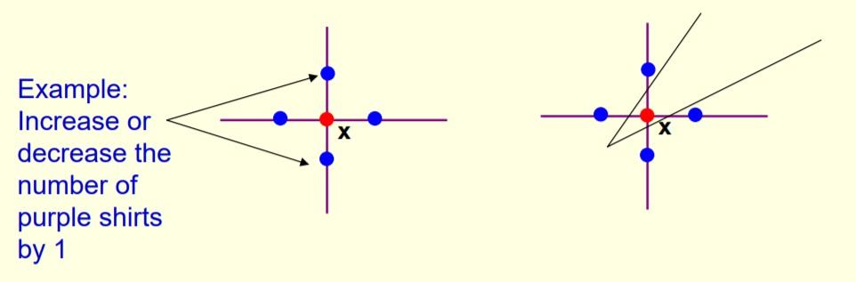
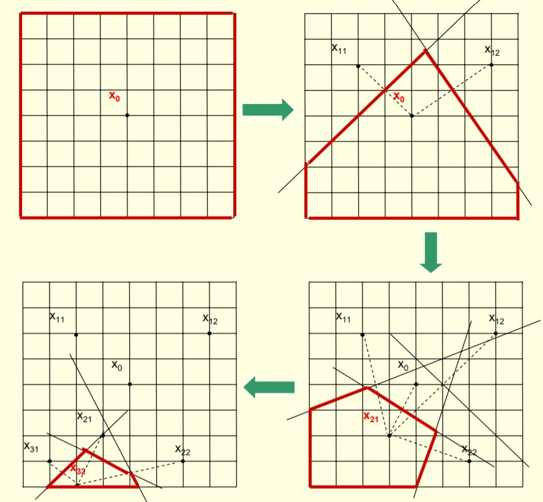

#  Optimization via Simulation (OvS)
  
>Hong, L. Jeff, and Barry L. Nelson. "A brief introduction to optimization via simulation." Proceedings of the 2009 Winter Simulation Conference (WSC). IEEE, 2009.
----
##  Problem definition
  
  

  
  
  
-  : vector of decision variable
-  : 직접 관찰 할 수 없음, 오직 가 시뮬레이션 작동으로 부터 관찰되는 것으로 부터 짐작 할 수 있음
-  문제 구조로부터 아주 조금의 정보만 알 수 있음 (예: convexity)
-   : 명백히 알고있다고 가정
  
  
----
##  Example
  
####  1. Highly reliable system
  
*Assumption*
- 시스템은 모든 하위 시스템이 작동할 경우에만 작동
- 모든 하위 시스템 구성 요소에는 자체 고장 시간 및 수리 시간 분포가 있음
  
***Objective function*** : 예산 제약을 고려하여 정상 상태 시스템의 비 가용성을 최소화
  
*Output* : 사용할 구성 요소 수와 구성 결정
  
*Feature* : 모든것을 시뮬레이션 해볼 수 있는 대안이 거의 없음
  
  
  
####  2. Traffic signal sequencing
  
  
*Output* : 도로 및 교차로 네트워크를 따라 빨간색, 노란 및 녹색 화살표 신호의 길이 설정
  
***Objective function*** : 운전자 지연 시간 최소화
  
*Feature* : 주기 길이는 자연스럽게 연속값 결정 변수로 취급됨
  
  
  
####  3. Inventory management with dynamic customer substitution 
  
  
*Output* : 얼마나 많은 재고를 쌓아 두어야 할까?
  
***Objective function***: 기대 수익 최대화
  
*Feature* : 재고들은 자연스럽게 정수로 취급됨 (예: 보라색 티 몇장...) 
  
----
##  Classification
  
feasible ragion인   structure에 따라 다음과 같이 나눠진다.
  
###  1. Selction of the best
  
- 의 솔루션이 적을 때 (100개 미만)
- 모든 경우 simulation해보고 그 중 best 선택 (가장 많은 경우)
  
###  2. Continuous OvS (COvS)
  
- 가 convex이며 실수 집합일 때
- 가 continuous decision variable
  
###  3. Discrete OvS (DOvS)
  
- 가 d-dimension 정수 
- 가 integer-order decision variable
  
----
##  Do these things fit?
  
- 모든 주문을 제 시간에 배달할 가능성이 가장 높은 전략 찾기
    - Yes! 확률은 예상값 {0, 1} 출력이기 때문
  
- 가장 오래 생존할 가능성이 높은 설계 찾기
  - No! 설계의 성능은 경쟁자와 비교해서만 판단할 수 있고, 분리해서 판단할 수 없기 때문에
  
- 내년에 달성할 실제 이익 극대화
  - No! 사실 불확실성이 있을 때는 불가능
  
----
  
----
#  Discrete OvS
  
  
##  Problem definition
  
  

  
  
  
-  : convex, closed and bounded subset of  and   is set of d-dimensional integers
  
- 통합 성 제약을 완화하는 알고리즘 (예 : 분기 및 경계)은 적용 할 수 없음 (예 : 12.3 셔츠로 재고를 시뮬레이션하는 방법이 명확하지 않음)
  
  
- 적응 형 무작위 검색 알고리즘이 자주 사용
  
##  Generic random search algorithm
  
  
1.   (=  ) 에서 일부 솔루션을 무작위로 샘플링
   - 그것들을 약간 시뮬레이션
   - 그 중 최적인 샘플을 선택
  
2. 몇 가지 추가 솔루션을 무작위로 샘플링
   - 이미 일부 (분명히) 좋은 솔루션을 본 적이있는  영역을 선호할 것 임 (배타적으로는 아님).
  
3. 이전 반복의 솔루션보다 조금 더 새로 샘플링 된 솔루션을 시뮬레이션
  
4. 새 솔루션 중 가장 좋은 샘플을 현재 최적으로 선택
  
5. 시간이 없으면 중지하고 현재 최적 상태를 결과로 도출
   - 그렇지 않으면 2로 이동
  
  
##  Global Convergence
  
Random-search 알고리즘을 이용한 global convergence에는 다음과 같은 예가 있다.
- Stochastic ruler method (Yan and Mukai 1992)
- Simulated annealing (Alrefaei and Andradottir 1999)
- Nested partitions (Shi and Olafsson 2000)
  
  
  
시뮬레이션 작동 시간이 무한대로 진행됨에 따라…
- 모든 솔루션이 샘플링 됨
- 모든 솔루션은 무한한 횟수로 시뮬레이션됩니다.
- 두 가지 요구 사항을 보장하기 위해 서로 다른 체계가 사용됩니다.
  
  
##  Improving Finite-Time Performance
  
  
Andradottir (1999)는 해의 값을 추정하기 위해 누적 표본 수단을 사용할 것을 제안했다.
  
- 유한 시간 성능이 훨씬 좋아집니다.
- 거의 확실한 수렴이 증명하기 쉬워 짐 (모든 솔루션이 무한히 자주 시뮬레이션 됨)
- 점근 적 정규성이 확립 될 수 있습니다.
  
##  Drawbacks of Global Convergence
  
좋은 수렴 결과를 제공하기는 합니다.
- 알고리즘이 충분히 오래 실행되는 경우 알고리즘의 정확성을 보장함
- 한정된 시간 내에 알고리즘을 중지 할시기를 결정하는 데 도움이 됨
  
하지만 글로벌 컨버전스는...
- 초기 해들은 앞선 장점을 가지지만 이후 솔루션에 대해서는 거의 정보를 제공하지 않음 (모든 솔루션을 샘플링해야하기 때문에).
- 알고리즘이 제한된 시간 내에 중지 될 때 정보를 거의 제공하지 않음
  
  
##  Local Convergence
  
Definition of the local neighborhood of x

  
  
  
 is a local optimal solution if

  
  
  
  

  
  
##  Convergent Optimization via Most Promising Area Stochastic Search (Hong and Nelson 2006)
  
1. 지오메트리를 기반으로 현재 샘플 최상의 솔루션을 중심으로 각 반복에서 가장 유망한 영역을 구축
  
2. 각 반복에서 가장 유망한 영역에서 새로운 솔루션을 샘플링
3. 모든 샘플 솔루션을 조금 더 시뮬레이션
4. 각 솔루션의 누적 표본 평균을 계산하고 누적 표본 평균이 가장 좋은 솔루션을 선택
  

  
  
##  Framework for LCRS Algorithms
  
COMPASS는 locally convergent random search
(LCRS) algorithms (Hong and Nelson 2007)에서 부터 발전됨
  
*Condition*
  
- 샘플링 솔루션 : 샘플 근처의 솔루션은 기회가 있어야함
- 시뮬레이션 솔루션 : 현재 최고, 방문한 이웃 및 새로 샘플링 된 모든 솔루션은 계속해서 더 많은 시뮬레이션을 할 수 있어야 함.
- 컨버전스를 손상시키지 않고 프레임 워크 내에 속도 향상 및 스마트 휴리스틱을 내장 할 수 있음
  
  
##  Properties of Local Convergence
  
  
- LCRS 알고리즘은 보통 빠르게 수렴됨
- 정지 기준을 설계하는 데 사용할 수 있음
  - 솔루션의 로컬 이웃에있는 모든 솔루션을 방문하고 솔루션이 이웃보다 나은 것처럼 보일 때
  - Xu et al. (2010) 지역 최적 성 테스트를위한 선택 절차 설계
- 알고리즘은 글로벌 최적 솔루션보다 훨씬 더 나쁜 로컬 최적 솔루션 만 찾을 수 있음
  
##  Industrial Strength COMPASS
  
  
  
  