#  Spatial arrangement using deep reinforcement learning to minimise rearrangement in ship block stockyards
  
>Kim, Byeongseop, Yongkuk Jeong, and Jong Gye Shin. "Spatial arrangement using deep reinforcement learning to minimise rearrangement in ship block stockyards." International Journal of Production Research (2020): 1-15.
----
  
##  Abstract
  
- shipbuilding 은 order  engineering
- 스케쥴 프로세스 동안에 바로 하위 프로세스 적용되지 못하면 waiting 발생
- 이런 waiting process 들은 예상되지 않는 상황으로 인해 시간과 공간에 대한 계획을 미리 수립할 수 없음
- 따라서 stockyard로 부터 출발하거나 shipblock으로 넣을 때 불필요한 움직임 발생
- 이 논문에서는 이런 상황에서 재 조리하는 것의 이동 횟수를 minimize하는 것을 RL로 제안
- 환경 block 배치 및 재배치 , reward : 간단화된 rule
  
---
  
##  1. Introduction
  
###  1.1. Background
  
  
- shipyard 특징
  - 미리 정해진 스케줄대로 하긴 하지만, 인적요소, 날씨, 예상치 못한 상황 등에 의해 늦어짐
  - block들은 다른 프로세스를 하고 있고, 다른 workshop으로 옮겨지기 때문에 부분적으로 정체됨
  - 다음 프로세스나 workchop이 free가 되어야 block은 비로소 옮겨질 수 있음
  - 적재되는 기간은 며칠에서 몇 주가 소요되기도 함
  
- 스케쥴링의 어려움
- block transportation의 특징
- Metaheuristic 으로 해 왔지만 어려움
- 최근 Deep Neural Network 시도
  - 하지만 prediction part엥서 반복하는 시간 너무 오래 걸림
  - 실제 worker가 내리는 결정이 필요함
- 그렇지만 RL은 train data 존재 하지 않아 도 됨
  
###  1.2. Related works
  
###  1.2.1. Ship block arrangement problem
  
  
- Planar storage location assignment problem(PSLAP)
- NP-hard problem
- heauristics로 풀려던 시도 있음 (GA)
- container arrangement problem in cargo terminal area 와 문제가 유사함
  
###  1.2.2. Reinforcement learning
  
- Q-learning
- deep Q-network(DQN)
- Monte Carlo tree search (MCTS)
- A3C 
  
###  1.3. Method and structure
  
- Environment: Spatial arrangement problem in ship block stockyard
- 주어진 환경에서 reward를 최대화 하는 모델 만드는 것
- 목표: to determine the location that minimises unnecessary transporter movement during the rearrangement stage
- 모델은 실제 shipyard production planning data로 확인하고, 휴리스틱이나 manually 하게 만든 결과와 비교
  
---
##  2. Problem definition
  
###  2.1. Ship block logistics and arrangement in shipyards
  
- Stockyard는 common과 normal로 나뉜다.
  
**Normal**
  
- particular workshop에 속함
- 만약 block의 선행작업이 모두 끝났고, 다음 process 로 바로 시작 못하면 후속 작업과 가까운 normal stockyard에 적재됨
- 만약 가까운데에 normal이 없다면 다른 workshop으로 옮겨짐
- (특징) 다소 크기가 작고, 많은 block을 적재하지 못하고, block 이용 시 장애물로 인한 재배치가 거의 발생하지 않음
  
  
**Common**
  
- 많은 block을 저장하고, 장애물에 의한 움직임이 발생
- 때에 따라 움직이지 못할 수가 있음
- 따라서 이 부분이 issue!
  
  
**Rearrangement**
- stockyard 의 block을 다른 곳으로 옮기는 것
- 추가적인 비용 발생
- 블록 운송될 때 마다 재배치 하게 되며 다른 작업에 필요한 여러 업체가 단일 창고에서 동시 작업하는 상황 발생
- 정규 근무시간 이후 휴무시간에 재배치 작업 수행
  
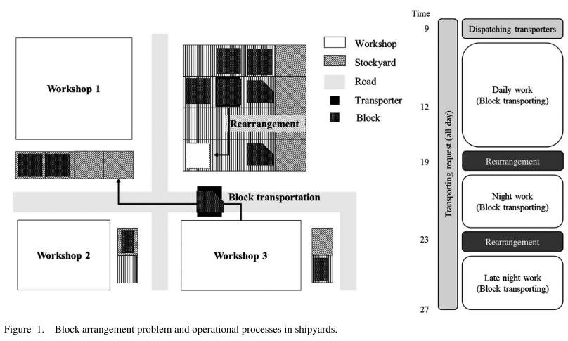
  
- common stockyard의 재배치 작업은 다음날 출하 될 블록을 주요 도로와 가까운 특정 주소로 이동하는 것으로 제한
  - 이 경우 같은 stockyard 안에서 다른 곳으로 가는 경우는 재배치 안해도 됨
  
- transporter usage관점에서 보면, block entry/exit 나눠서 볼 수 있음
  - 따라서, transporter 관점에서 두 단계로 나눌 수 있음
  
###  2.2. Decision processes in the ship block arrangement problem
  
- Ship block arrangement 문제는 1) 배치할 block 선택 2) 재배치 결정, 이 두가지를 고려한다. 
  
- 움직일 block의 개수는 다르다. 그리고 이건 원래 장소와 stockyard의 상태에 따라 다름
- 비슷하게, 다음 block의 위치는 재배치의 결과에 따라 다르게 선택되어야 함
  
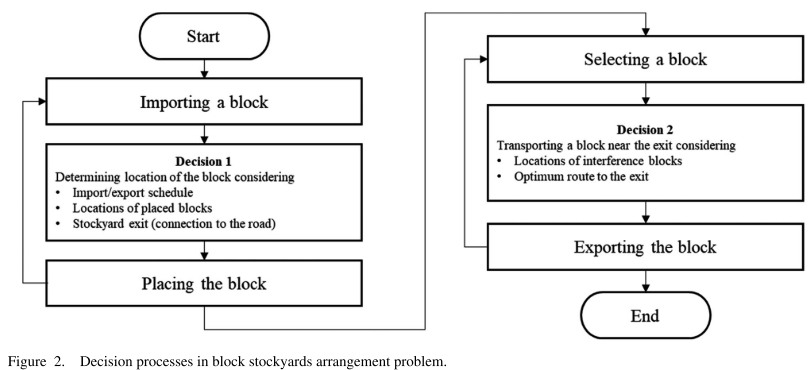
  
  
- Agent : 주어진 환경에 대한 정보를 입력받아 결정을 내리는 엔터티
  - 이 시스템에서는 multi-agent system (MAS)
- Environment을 정해주는 것이 1차 목표
  - MDP: 에서 와 주어질 때, 다음 이 transition probability, 에 의해 결정되는 것. 그리고 reward는 와 가 주어졌을 때 다음 에 의해 결정됨
  - MPD는 단독 agent이어야 한다. 
  - 따라서 MAS는 기존 MDP로는 정의 못함
  - MAS는 Markov game framework 류로 제안됨
  - 기존 논문들은 single MDP 문제는 잘 풀지만 ship block문제는 그렇지 않으므로 situation을 제한하고, 각 agent를 MPD로 보고 RL을 적용함
---
##  3. Reinforcement learning algorithm for ship block arrangement in stockyards 
  
###  3.1. Analysis of the ship block arrangement problem in stockyards
  
  
- transporting agent (TA)와 location agent (LA)로 나눠 학습시킴
  
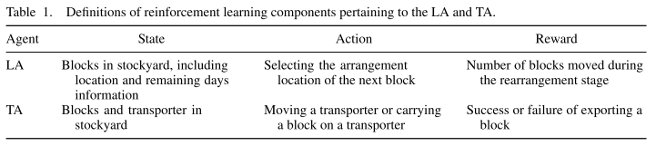
  
- Assumption
  - rectangular grid (
  - 오른쪽 세로에 출구/입구 있음 ()
  
- Agent는 block의 location infomation과 stockyard의 remaining period 고려해야 함
- status: 
  -  : no block (0 과 가까운 블록과 차별하기 위함)
  -  : 이미 보유한 블록의 남은 기간과 기존 블록의 남은 기간의 상대적 비율, 입력데이터의 스케일 차이 방지위해 제한
  
  
  
**LA**
- LA : LA는 stockyard 내 블록의 현재 상태를 기반으로 다음 재배치 중에 재배치가 발생하는 횟수를 최소화하기 위한 위치 결정
  
  
- The arrangement location인 LA는 action space A를 결정 함. 
  - 따라서 
  
- 재배치 이벤트는 배치 이후 바로 일어나지 않을 수 있기 때문에, LA의 reward는 바로 얻을 수 없음
- 대신,  block이 재배치가 일어날 때 block이 움직인 개수가 reward로 계산된다. 
- LA의 각 step은 block이 움직인 위치와 관련있고, 각 에피소드는 특정 기간의 arrangement schedule과 관련됨 (50~100개 block)
  
  
**TA**
- TA : 재배치 성능과 관련
- 최근 끝난 재배치 event를 이후에 다음날 바로 빠져나갈 block들은 장애물이 발생하지 않도록 출구 방향으로 block 재배치
- Environment: 2D grid state
- Action: 좌우 위 아래, loading/ unloading
- Reward: 목적지에 도착하면 부여 받음
  - 만약 도착 못하면 negative reward
  - 도착하면 positive reward에 이동횟수만큼 삭감
  
  
- TA는 단순히 목적지로 이동하지 않음. 대신 선택한 블록을 운송기로로드 및 언로드하고 블록을 선택한 위치로 운송하는 프로세스를 수행
- State: 각 셀의 상태는 
  - 문제에 따라 그리드에 장애물과 목적지에 해당하는 셀이 있고이 정보가 상태에 표시됨. 따라서 에이전트는 그것을보고 행동을 결정
  - 최근에 옮겨짐
  - 비어있음
  - block이 있음
  - 무조건 옮겨져야 함
  - 도착지점에 있음
  
- Episode: 블록 스톡 야드에서는 목적지까지의 도로가 다른 블록에 의해 막히는 경우가 있음. 이 경우 도로를 가로막고있는 블록은 반드시 이동해야하는 블록을 이동하기 전에 다른 위치로 이동해야함. 그러나 본 연구에서는 TA의 결정 과정을 별도로 분할하지 않고 에피소드가 끝나고 지정된 블록이 선택된 목표로 이동되어야 보상을 받도록 설계. *(그러면.. 옮기는건..?????)*
  
**RL**
- RL은 MDP 주어졌을 때 optimal policy 찾는 것
- policy ()가 주어질 때, 각 state 는 Bellman equation form으로 나타내질 수 있음 (reward 가 maximized 되게)
- Q-learning: action-value function이용, policy function이용해서 policy gradient 하는 것
  
###  3.2.Reinforcement learning algorithm to solve the ship block arrangement problem 
  
  
- 두 agent에 대해 MDP 정의 해야 함
- LA는 action에 바로 reward받을 수 없음
  - 장애물이 발생했을 때 재배치해야 할 상황에서 움직이는 개수로 reward 계산된다.
  - 모든 액션에 재배치가 일어나지 않음, 따라서 LA는 다음 재배치가 발생할 때 되어서야 reward 받게 됨
  - LA는 환경보다는 TA에 관련되서 reward 받게 됨. 따라서 reward 받을 때 프로세스 사이에는 TA와 상호작용하게 됨
  
- TA는 재배치에 대한 single episode 프로세스
  - LA action에서 재배치 여부를 결정되면, 그 뒤에는 LA와는 독립적으로 학습됨
  - 매 step에 즉각적으로 reward 받을 수 있음
  - 따라서 A3C쓸 수 있음
  - 결론적으로, TA가 먼저 성공적으로 학습되고, 그 뒤에 LA가 학습됨
  
**LA train**
  
- A3C알고리즘 바탕, 위애 두가지를 고려한 feature들을 고려함 (재배치 일어나고, TA가 움직인 개수)
- muliple threads in a single machine like the A3C 방법
- actor-learner은 Fig4처럼 학습됨
- reward는 위치된 블록의 재배치 결과로 받음
- 이 재배치 프로세스는 TA가 먼제 학습된 후에 사용됨
- 사용된 TA는 이 과정에서 더이상 학습되지 않음
  
  
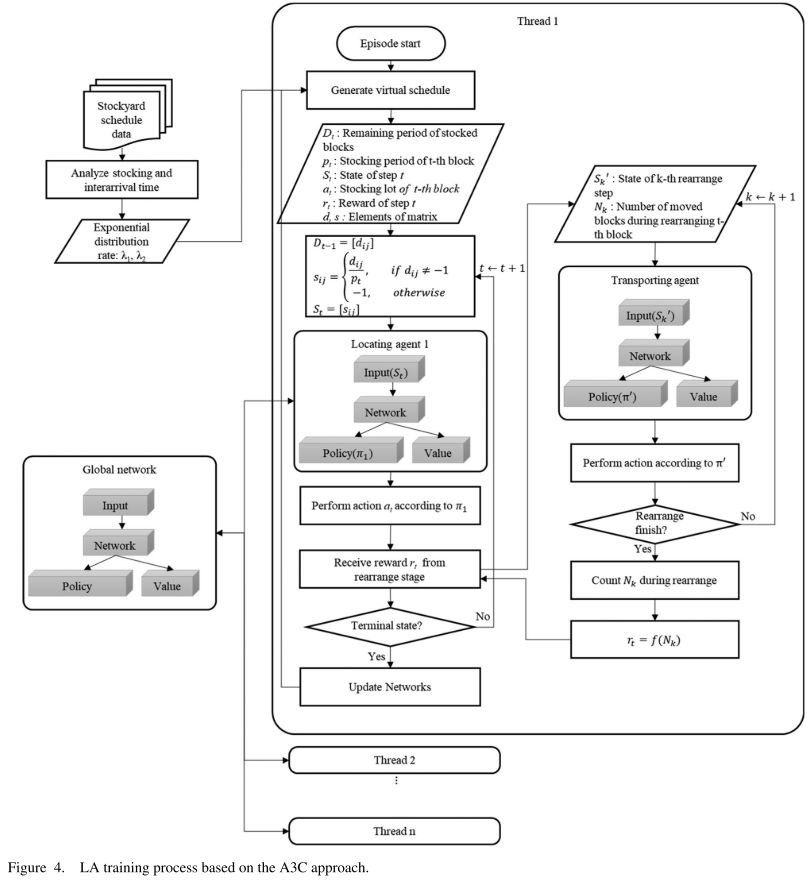
  
  
- LA의 single agent는  로 구성된 네트워크를 이용한 policy 에 의해 하나의 action을 선택
- reward는 학습이 끝난 TA를 이용해서 재배치 상황이 주어졌을 때 block 움직임이 작아질 수록 많이 받게 됨
  
  
  
---
##  4. Experiments
  
###  4.1. TA training
  
- TA가 A3C로 첫번째로 학습됨
- Goal: 다음날 옮겨질 block을 main road로 옮기는 것
- 한 에피소드마다 뭘 옮길 지 block이 정해짐
- 도착지에 도착했을 때 singlereward 받게 됨
- LA 없이 학습 됨
- stockyard에 랜덤 넘버의 블록들은 랜덤한 location에 배치되고, 이중에 랜덤하게 적재될 것
- Environment: 1-20 블럭들이  사각형의 stockyard 랜덤하게 위치
- ***실제는.. 블록마다 차지하는 공간이 다 다를텐데! 그럼 갈 수 있는 길도 달라지고! 이 부분을 고도화 시켜보면 되겠다***
  
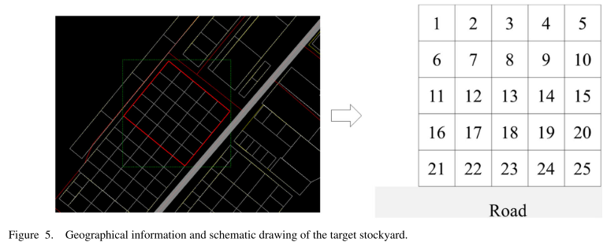
  
- 200,000 에피소드로 트레인할 때 에피소드 길이와 대해 reward가 바뀌는 것 보여줌
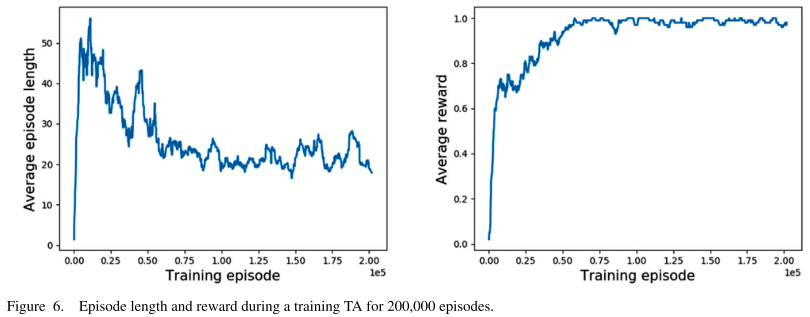
  
  
###  4.2. LA training
  
- 미리 train된 TA로 block movement 개수가 구해져야 함
- stockyard가 75% 이하로 차여있으면, block들은 optimal path로 대부분 출고 됨
- LA train에서는 선박 블록 배치 기록에서 얻은 확률 분포를 사용하여 실제 조선소의 선박 블록 배치 일정 동향에 맞춰 학습
  
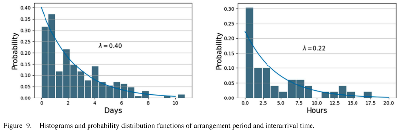
  
- 이 확률 밀도 함수에 따라 블록에 대해 50 개의 가상 일정이 생성
- 이것들은 하나의 에피소드로 만들어지고 훈련이 수행됨
- 각 에피소드마다 새로운 가상 일정이 사용됨
- ***일정에 대해서 optimization..? 흠.. too much 인가.. 필요없는건가...***
  
- Fig10은 11,000 에피소드의 평균 reward와 평균 길이 결과
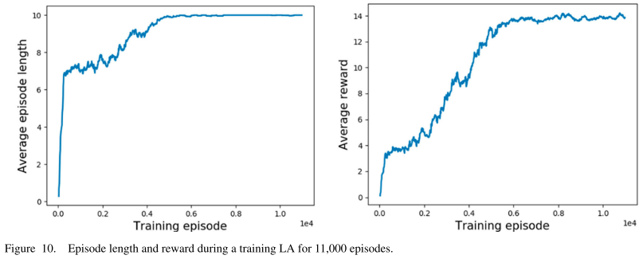
  
- Fig11은 Policy example 
  - 왼쪽은 최근 block들의 적재 상황
  - 시간 기간은 색으로 나타냄 
  - 오른쪽은 block이 위치할 problblity 나타냄 
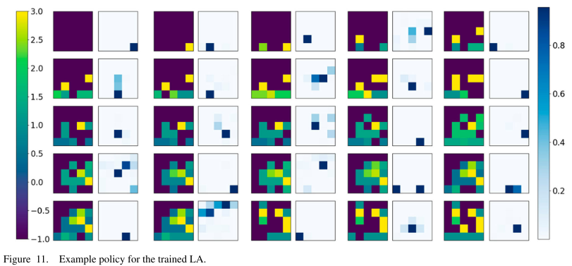
  
###  4.3. Evaluation of trained LA
  
- 같은 TA 모델 사용해서 휴리스틱과 비교함
  
- Fig13은 A3C, BLF, PSLAP의 재배치 개수 비교한 것임
  - LA는 policy이용해서 arrangement location을 결정함. 따라서 배치하는 위치는 고정되어 있지 않음
  - A3C가 나머지들 보다 재배치 수가 적음
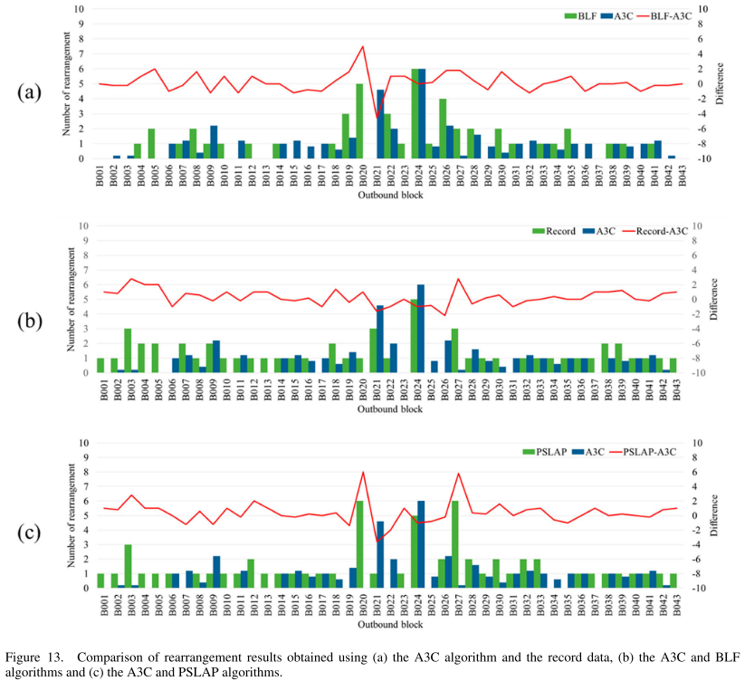
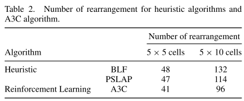
  
---
  
##  5. Conclusions
  
  
- 실제 조선소 운영 프로세스는 본 연구에 완전히 반영되지 않았음
  
## 6. 의견

-   모양을 고려한 시뮬레이션 $\to$ action에는 회전도 포함 
- 멀티 프로세스 고려 (지금은 한 shipyard에서 어디에 배치할지, 어떻게 뺄지)
  - 블록 사용하는 순서 고려 (이걸 수학적으로 어떻게 나타낼 지)
  - 아예 전체 프로세스를 한 에피로..? (stage 있는 게임처럼! 쿠킹 게임)
  - 1. 작업 순서 학습 2. 거기에 맞춰 배치 전략 도출 3. 재배치 경로 학습
  - 이걸 RL로 하려면 거꾸로 학습!
  - 여기서 3번할 때 회전도 있음 
  - 이 게임의 관건은 주어진 프로세스를 빠르게 깨는 것 
  - 움직임 1마다, 도는 것 1마다 - reward, 퀘스트 순서 있음 다인 player 등등..  

